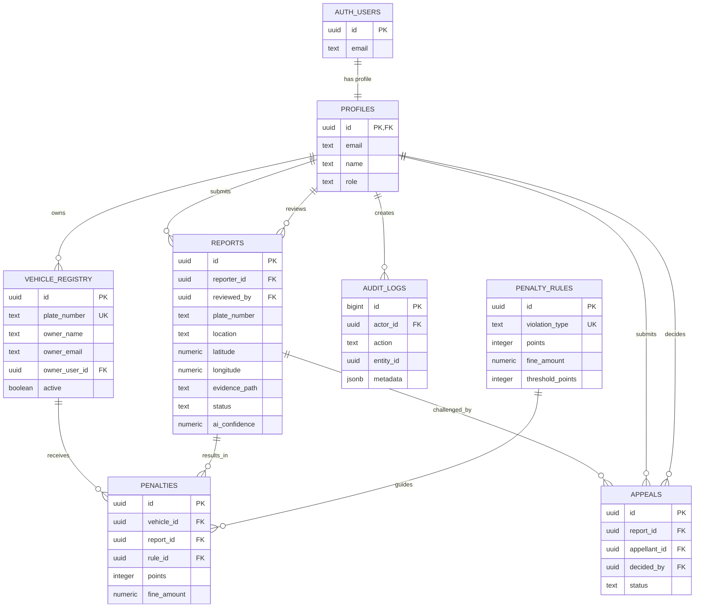

# KKU ParkFlow ER Diagram

`supabase.sql` is the canonical production schema for the deployed frontend. The older `db/schema.sql` is retained only for the legacy Express/PostgreSQL demo and is not the schema used by the Supabase client.

## Notes

- `auth.users` is managed by Supabase Auth; `profiles.id` must equal `auth.users.id`.
- Reporter identity is not exposed through the public report list; RLS restricts normal users to their own reports.
- Admin access is determined by `profiles.role` (`admin` or `super_admin`).
- `tester` is a restricted role and does not receive admin access.
- Evidence files belong in the private `evidence` Storage bucket and should never be made public.
